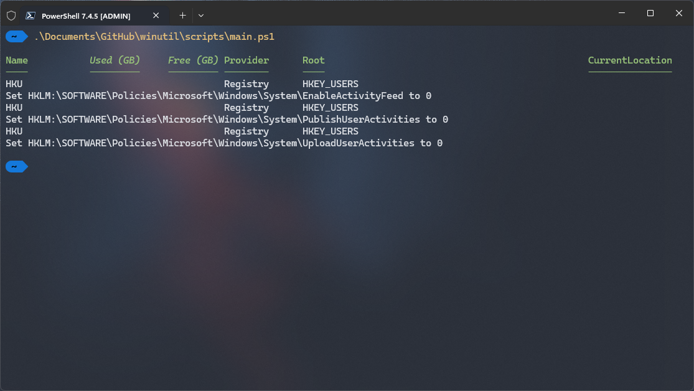

# Windows Utility CLI

  

`winutil-cli` is  a [winutil](https://github.com/ChrisTitusTech/winutil/) fork that removes some features.

  


  

## 💡 Usage

  

Winutil must be run in Admin mode because it performs system-wide tweaks. To achieve this, run PowerShell as an administrator. Here are a few ways to do it:

  

1. **Start menu Method:**

   - Right-click on the start menu.

   - Choose "Windows PowerShell (Admin)" (for Windows 10) or "Terminal (Admin)" (for Windows 11).

  

2. **Search and Launch Method:**

   - Press the Windows key.

   - Type "PowerShell" or "Terminal" (for Windows 11).

   - Press `Ctrl + Shift + Enter` or Right-click and choose "Run as administrator" to launch it with administrator privileges.

### Launch Command

#### Standard

```ps1
irm "https://userdrift.github.io/win" | iex
```
#### Security

```ps1
irm "https://userdrift.github.io/winsecurity" | iex
```

#### Security

```ps1
irm "https://userdrift.github.io/winminimal" | iex
```

### Clone git repository


```
git clone https://github.com/userdrift/winutil-cli.git
```


# Function list

## Set-WPFTweaksAH
 *Disable Activity History*
***This erases recent docs, clipboard, and run history.***

## Set-WPFTweaksHiber
*Disable Hibernation*
***Hibernation is really meant for laptops as it saves what's in memory before turning the pc off.***

## Set-WPFTweaksLaptopHibernation
*Set Hibernation as default (good for laptops)*
****Most modern laptops have connected standby enabled which drains the battery, this sets hibernation as default which will not drain the battery.***

## Set-WPFTweaksHome
*Disable Homegroup*
**Disables HomeGroup - HomeGroup is a password-protected home networking service that lets you share your stuff with other PCs that are currently running and connected to your network.**

## Set-WPFTweaksLoc
*Disable Location Tracking*

## Set-WPFTweaksServices
*Set Services to Manual*
**Turns a bunch of system services to manual that don't need to be running all the time. This is pretty harmless as if the service is needed, it will simply start on demand.**

## Set-WPFTweaksEdgeDebloat
*Debloat Edge*
**Disables various telemetry options, popups, and other annoyances in Edge.**

## Set-WPFTweaksConsumerFeatures
*Disable ConsumerFeatures*
**Windows 10 will not automatically install any games, third-party apps, or application links from the Windows Store for the signed-in user. Some default Apps will be inaccessible (eg. Phone Link)**

## Set-WPFTweaksTele
*Disable Telemetry*
**Disables Microsoft Telemetry. Note: This will lock many Edge Browser settings. Microsoft spies heavily on you when using the Edge browser.**

## Set-WPFTweaksWifi
*Disable Wifi-Sense*
**Wifi Sense is a spying service that phones home all nearby scanned wifi networks and your current geo location.**

## Set-WPFTweaksUTC
*Set Time to UTC (Dual Boot)*
**Essential for computers that are dual booting. Fixes the time sync with Linux Systems.**

## Set-WPFTweaksRemoveHomeGallery
*Remove Home and Gallery from explorer*
**Removes the Home and Gallery from explorer and sets This PC as default**

## Set-WPFTweaksDisplay
*Set Display for Performance*
**Sets the system preferences to performance. You can do this manually with sysdm.cpl as well.**

## Set-WPFTweaksDeBloat
*Remove ALL MS Store Apps - NOT RECOMMENDED*
**Remove ALL Microsoft store apps other than the essentials to make winget work.**

## Set-WPFTweaksRestorePoint
Create Restore Point
Creates a restore point at runtime in case a revert is needed from WinUtil modifications

## Set-WPFTweaksEndTaskOnTaskbar
Enable End Task With Right Click
Enables option to end task when right clicking a program in the taskbar

## Set-WPFTweaksPowershell7
Change Windows Terminal default: PowerShell 5 -> PowerShell 7
This will edit the config file of the Windows Terminal replacing PowerShell 5 with PowerShell 7 and installing PS7 if necessary

## Set-WPFTweaksPowershell7Tele
Disable Powershell 7 Telemetry
This will create an Environment Variable called 'POWERSHELL_TELEMETRY_OPTOUT' with a value of '1' which will tell Powershell 7 to not send Telemetry Data.

## Set-WPFTweaksStorage
Disable Storage Sense
Storage Sense deletes temp files automatically.

## Set-WPFTweaksRemoveEdge
Remove Microsoft Edge
Removes MS Edge when it gets reinstalled by updates.

## Set-WPFTweaksRemoveCopilot
Disable Microsoft Copilot
Disables MS Copilot AI built into Windows since 23H2.

## Set-WPFTweaksDisableLMS1
Disable Intel MM (vPro LMS)
Intel LMS service is always listening on all ports and could be a huge security risk. There is no need to run LMS on home machines and even in the Enterprise there are better solutions.

## Set-WPFTweaksRemoveOnedrive
Remove OneDrive
Moves OneDrive files to Default Home Folders and Uninstalls it.

## Set-WPFTweaksDisableNotifications
Disable Notification Tray/Calendar
Disables all Notifications INCLUDING Calendar

## Set-WPFTweaksRightClickMenu
Set Classic Right-Click Menu
Great Windows 11 tweak to bring back good context menus when right clicking things in explorer.

## Set-WPFTweaksDiskCleanup
Run Disk Cleanup
Runs Disk Cleanup on Drive C: and removes old Windows Updates.

## Set-WPFTweaksDeleteTempFiles
Delete Temporary Files
Erases TEMP Folders

## Set-WPFTweaksDVR
Disable GameDVR
GameDVR is a Windows App that is a dependency for some Store Games. I've never met someone that likes it, but it's there for the XBOX crowd.

## Set-WPFTweaksTeredo
Disable Teredo
Teredo network tunneling is a ipv6 feature that can cause additional latency.

## Set-WPFTweaksDisableipsix
Disable IPv6
Disables IPv6.

## Set-WPFTweaksDisableBGapps
Disable Background Apps
Disables all Microsoft Store apps from running in the background, which has to be done individually since Win11

## Set-WPFTweaksDisableFSO
Disable Fullscreen Optimizations
Disables FSO in all applications. NOTE: This will disable Color Management in Exclusive Fullscreen


## **Some other functions**

## Display Settings
- Enable Dark Mode: `Invoke-WinUtilDarkMode -DarkMoveEnabled $false`
- Disable Dark Mode: `Invoke-WinUtilDarkMode -DarkMoveEnabled $true`

## Search Settings
- Enable Bing Search: `Invoke-WinUtilBingSearch -Enabled $false`
- Disable Bing Search: `Invoke-WinUtilBingSearch -Enabled $true`

## Startup Settings
- Enable NumLock on Startup: `Invoke-WinUtilNumLock -Enabled $false`
- Disable NumLock on Startup: `Invoke-WinUtilNumLock -Enabled $true`

## Logon Settings
- Enable Verbose Logon Messages: `Invoke-WinUtilVerboseLogon -Enabled $false`
- Disable Verbose Logon Messages: `Invoke-WinUtilVerboseLogon -Enabled $true`

## Window Management
- Enable Snapping Windows: `Invoke-WinUtilSnapWindow -Enabled $false`
- Disable Snapping Windows: `Invoke-WinUtilSnapWindow -Enabled $true`
- Enable Snap Assist Flyout: `Invoke-WinUtilSnapFlyout -Enabled $false`
- Disable Snap Assist Flyout: `Invoke-WinUtilSnapFlyout -Enabled $true`
- Enable Snap Assist Suggestions: `Invoke-WinUtilSnapSuggestion -Enabled $false`
- Disable Snap Assist Suggestions: `Invoke-WinUtilSnapSuggestion -Enabled $true`

## Mouse Settings
- Enable Mouse Acceleration: `Invoke-WinUtilMouseAcceleration -DarkMoveEnabled $MouseAccelerationEnabled $false`
- Disable Mouse Acceleration: `Invoke-WinUtilMouseAcceleration -DarkMoveEnabled $MouseAccelerationEnabled $true`

## Accessibility
- Enable Sticky Keys: `Invoke-WinUtilStickyKeys -Enabled $false`
- Disable Sticky Keys: `Invoke-WinUtilStickyKeys -Enabled $true`

## File Explorer Settings
- Show Hidden Files: `Invoke-WinUtilHiddenFiles -Enabled $false`
- Hide Hidden Files: `Invoke-WinUtilHiddenFiles -Enabled $true`
- Show File Extensions: `Invoke-WinUtilShowExt -Enabled $false`
- Hide File Extensions: `Invoke-WinUtilShowExt -Enabled $true`

## Taskbar Settings
- Show Taskbar Search Button: `Invoke-WinUtilTaskbarSearch -Enabled $false`
- Hide Taskbar Search Button: `Invoke-WinUtilTaskbarSearch -Enabled $true`
- Show Task View Button: `Invoke-WinUtilTaskView -Enabled $false`
- Hide Task View Button: `Invoke-WinUtilTaskView -Enabled $true`
- Show Taskbar Widgets: `Invoke-WinUtilTaskbarWidgets -Enabled $false`
- Hide Taskbar Widgets: `Invoke-WinUtilTaskbarWidgets -Enabled $true`
- Left Taskbar Alignment: `Invoke-WinUtilTaskbarAlignment -Enabled $false`
- Center Taskbar Alignment: `Invoke-WinUtilTaskbarAlignment -Enabled $true`

## System Settings
- Enable Detailed BSoD: `Invoke-WinUtilDetailedBSoD -Enabled $false`
- Disable Detailed BSoD: `Invoke-WinUtilDetailedBSoD -Enabled $true`

## Network Settings
- Set DNS Provider: `Set-WinUtilDNS -DNSProvider "ProviderName"` (e.g., Google, Cloudflare)

## Windows Update Settings
- Recommended Update Settings: `Invoke-WPFUpdatessecurity`
- Disable Windows Update: `Invoke-WPFUpdatesdisable`
- Reset Windows Update to Default: `Invoke-WPFUpdatesdefault`

## Performance Settings
- Enable Ultimate Performance Power Scheme: `Invoke-WPFUltimatePerformance -State "Enable"`
- Disable Ultimate Performance Power Scheme: `Invoke-WPFUltimatePerformance -State "Disable"`

## App Installation
- Install Selected App: `Invoke-WPFInstall`


# Getting things working

### add what ever functions you want to `script/main.ps1`




## main.ps1

```powershell
<#

.NOTES

    Version        : #{replaceme}

#>

  

param (

    [switch]$Debug

)

  

if ($Debug) {

    if (!(Test-Path -Path $ENV:TEMP)) {

        New-Item -ItemType Directory -Force -Path $ENV:TEMP

    }

    Start-Transcript $ENV:TEMP\winutil.log -Append -Force

}

  

If (([Security.Principal.WindowsIdentity]::GetCurrent()).Owner.Value -ne "S-1-5-32-544") {

    Write-Host "===========================================" -Foregroundcolor Red

    Write-Host "-- Scripts must be run as Administrator ---" -Foregroundcolor Red

    Write-Host "-- Right-Click Start -> Terminal(Admin) ---" -Foregroundcolor Red

    Write-Host "===========================================" -Foregroundcolor Red

    break

}

  

# SPDX-License-Identifier: MIT

# Dot-source every private function

Get-ChildItem -Path "$PSScriptRoot\..\functions\private\" | ForEach-Object { . $_.FullName }

# Dot-source every public function

Get-ChildItem -Path "$PSScriptRoot\..\functions\public\" | ForEach-Object { . $_.FullName }

  

# $path_ = "$PSScriptRoot\..\config\toggle.json"

# $raw_ = Get-Content -Path $path_ -Raw | ConvertFrom-Json

Set-WPFTweaksAH # (Disables Activity History)
```
