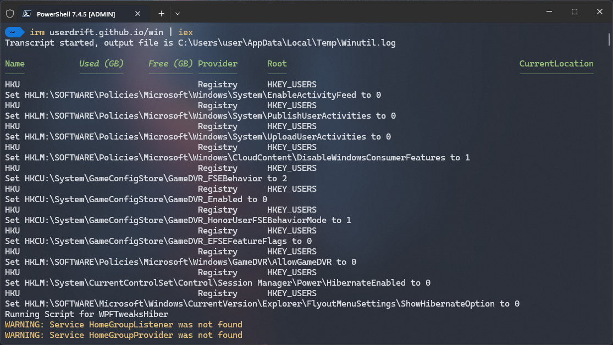

# Windows Utility CLI

`winutil-cli` is  [winutil](https://github.com/ChrisTitusTech/winutil/) fork on a command line, and it adds a `-Build` switch that allows the user to build a script that will run all selected tweaks, and it removes some features.



## 💡 Usage

Winutil must be run in Admin mode because it performs system-wide tweaks. To achieve this, run PowerShell as an administrator. Here are a few ways to do it:

1. **Start menu Method:**
   - Right-click on the start menu.
   - Choose "Windows PowerShell (Admin)" (for Windows 10) or "Terminal (Admin)" (for Windows 11).

2. **Search and Launch Method:**
   - Press the Windows key.
   - Type "PowerShell" or "Terminal" (for Windows 11).
   - Press `Ctrl + Shift + Enter` or Right-click and choose "Run as administrator" to launch it with administrator privileges.

### Launch Command

#### Stable Branch

```ps1
irm "https://userdrift.github.io/nothing" | iex
```